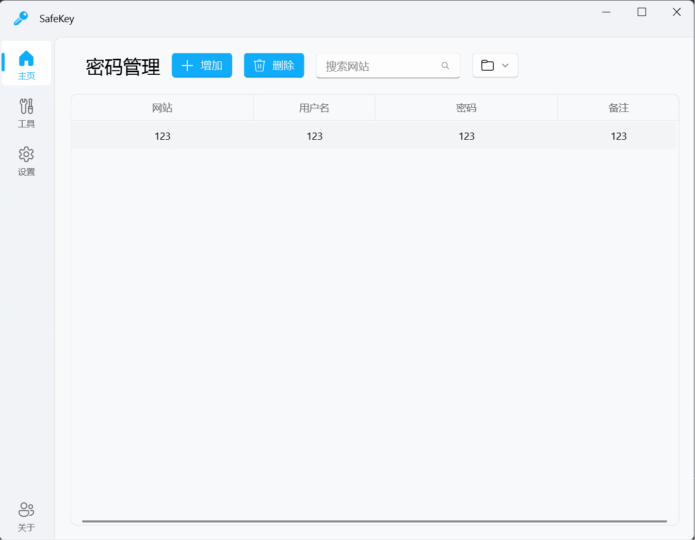
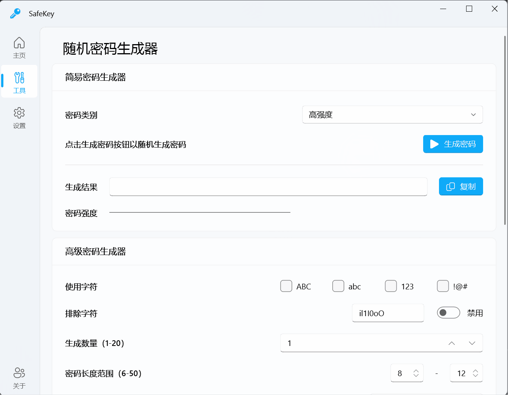
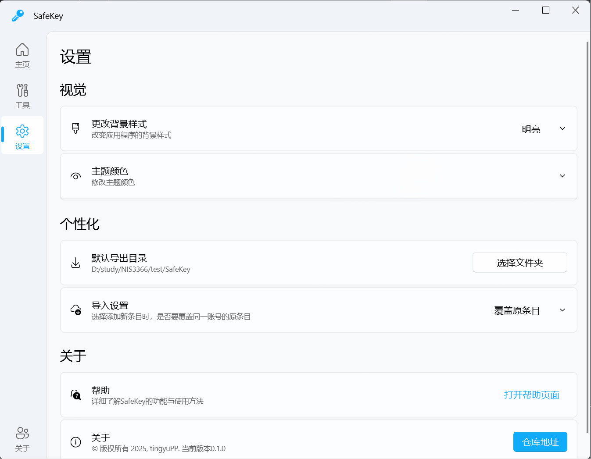

<p align="center">
  
</p>
<h1 align="center">SafeKey</h1>

<p align="center">
一款基于PyQt5及PyQt-Fluent-Widgets的简易密码管理工具。
</p>

## 快速开始🚀

首先，创建一个conda环境，并安装所有要求的pip包。

```shell
conda create -n safekey python==3.11
conda activate safekey

git clone https://github.com/tingyuPP/SafeKey.git
cd SafeKey
pip install PyQt-Fluent-Widgets -i https://pypi.org/simple/
pip install pycryptodome
```

然后，运行SafeKey.py即可。

```shell
python SafeKey.py
```

## 运行示例▶️

### 密码管理



### 随机密码生成



### 自定义设置



## 项目特点🔥

- 便捷的密码管理体验：直接基于表格对密码数据库进行操作，简单便捷。
- 密码强度安全保障：内置的随机密码生成器能够快速生成高强度，满足用户需要的密码。
- 便于设备迁移：提供导入/导出到文件的功能，方便设备迁移。

## 参考👀

- https://qfluentwidgets.com/
